```mermaid
classDiagram
    class BaseModel {
        +dict()
        +json()
    }

    class Tag {
        +str chave
        +str valor
    }

    class Evento {
        +str tipo_evento
        +datetime timestamp
        +Optional~str~ mensagem
    }

    class RecursoBase {
        +str nome
        +Optional~str~ descricao
        +List~Tag~ tags
        +List~str~ recursos_relacionados
    }

    class RecursoNoBD {
        +PyObjectId id
        +List~Evento~ eventos
    }

    class UsuarioBase {
        +str nome_usuario
        +EmailStr email
        +Optional~str~ nome_completo
        +str papel
    }

    class UsuarioCriar {
        +str senha
    }

    class UsuarioNoBD {
        +PyObjectId id
        +str senha_hash
        +bool desabilitado
    }

    class Token {
        +str token_acesso
        +str tipo_token
    }

    class DadosToken {
        +Optional~str~ nome_usuario
    }

    class ConfiguracaoApp {
        +Optional~str~ url_icone
        +bool oauth2_habilitado
        +Optional~str~ url_provedor_oauth2
        +Optional~str~ id_cliente_oauth2
        +Optional~str~ segredo_cliente_oauth2
        +Optional~str~ escopo_oauth2
        +Optional~str~ url_redirecionamento_oauth2
        +Optional~str~ url_info_usuario_oauth2
        +Optional~str~ atributo_nome_usuario_oauth2
        +Optional~str~ atributo_email_oauth2
        +Optional~str~ texto_botao_login_oauth2
    }

    class RequisicaoExclusaoEmMassa {
        +List~str~ ids
    }

    class RecursoSaida {
        +ObjectIdStr id
        +str nome
        +Optional~str~ descricao
        +List~Tag~ tags
        +List~str~ recursos_relacionados
        +List~Evento~ eventos
    }

    class RecursoComRelacoesSaida {
        +List~str~ pais
        +List~str~ filhos
    }

    class RecursoCriar {
        +str nome
        +Optional~str~ descricao
        +List~Tag~ tags
        +List~str~ recursos_relacionados
    }

    class RecursoAtualizar {
        +Optional~str~ nome
        +Optional~str~ descricao
        +Optional~List~Tag~~ tags
        +Optional~List~str~~ recursos_relacionados
    }

    class EventoCriar {
        +str tipo_evento
        +Optional~str~ mensagem
    }

    class No {
        +str id
        +str tipo
        +dict dados
        +dict posicao
    }

    class Aresta {
        +str id
        +str origem
        +str destino
        +bool animado
        +dict estilo
    }

    class MapaServico {
        +List~No~ nos
        +List~Aresta~ arestas
    }

    class UsuarioSaida {
        +ObjectIdStr id
        +str nome_usuario
        +EmailStr email
        +Optional~str~ nome_completo
        +str papel
        +bool desabilitado
    }

    class UsuarioAtualizar {
        +Optional~EmailStr~ email
        +Optional~str~ nome_completo
        +Optional~str~ papel
        +Optional~bool~ desabilitado
        +Optional~str~ senha
    }

    class RecursoImportar {
        +str nome
        +Optional~str~ descricao
        +List~Tag~ tags
        +List~str~ recursos_relacionados
    }

    class ConfiguracaoAppSaida {
    }

    RecursoBase <|-- RecursoNoBD
    RecursoBase <|-- RecursoCriar
    RecursoBase <|-- RecursoAtualizar
    RecursoBase <|-- RecursoImportar

    RecursoSaida <|-- RecursoComRelacoesSaida

    UsuarioBase <|-- UsuarioCriar
    UsuarioBase <|-- UsuarioNoBD
    UsuarioBase <|-- UsuarioSaida
    UsuarioBase <|-- UsuarioAtualizar

    ConfiguracaoApp <|-- ConfiguracaoAppSaida

    MapaServico o-- No
    MapaServico o-- Aresta

    RecursoNoBD o-- Evento
    RecursoNoBD o-- Tag

    RecursoSaida o-- Evento
    RecursoSaida o-- Tag

    RecursoCriar o-- Tag
    RecursoAtualizar o-- Tag
    RecursoImportar o-- Tag

    UsuarioNoBD o-- Token
    UsuarioNoBD o-- DadosToken

    DadosToken o-- Token

    No o-- Tag

```

### Explicação do Diagrama:

Este diagrama de classes ilustra as relações entre os principais modelos de dados e schemas utilizados na aplicação, definidos principalmente usando Pydantic. Ele destaca:

*   **Herança:** Indicada por `ClasseA <|-- ClasseB`, significando que ClasseB herda de ClasseA. Por exemplo, `RecursoNoBD` herda de `RecursoBase`.
*   **Composição/Agregação:** Indicada por `ClasseA o-- ClasseB`, significando que ClasseA contém ou usa instâncias de ClasseB. Por exemplo, `RecursoNoBD` contém objetos `Evento` e `Tag`.
*   **Atributos Chave:** Cada classe lista seus atributos primários e seus tipos.

Este diagrama fornece uma visão geral de alto nível da estrutura de dados e como diferentes partes dos dados da aplicação são organizadas e relacionadas.