```mermaid
classDiagram
    class BaseModel {
        +dict()
        +json()
    }

    class Tag {
        +str key
        +str value
    }

    class Event {
        +str event_type
        +datetime timestamp
        +Optional~str~ message
    }

    class ResourceBase {
        +str name
        +Optional~str~ description
        +List~Tag~ tags
        +List~str~ related_resources
    }

    class ResourceInDB {
        +PyObjectId id
        +List~Event~ events
    }

    class UserBase {
        +str username
        +EmailStr email
        +Optional~str~ full_name
        +str role
    }

    class UserCreate {
        +str password
    }

    class UserInDB {
        +PyObjectId id
        +str hashed_password
        +bool disabled
    }

    class Token {
        +str access_token
        +str token_type
    }

    class TokenData {
        +Optional~str~ username
    }

    class AppConfig {
        +Optional~str~ icon_url
        +bool oauth2_enabled
        +Optional~str~ oauth2_provider_url
        +Optional~str~ oauth2_client_id
        +Optional~str~ oauth2_client_secret
        +Optional~str~ oauth2_scope
        +Optional~str~ oauth2_redirect_uri
        +Optional~str~ oauth2_userinfo_url
        +Optional~str~ oauth2_username_attribute
        +Optional~str~ oauth2_email_attribute
        +Optional~str~ oauth2_login_button_text
    }

    class BulkDeleteRequest {
        +List~str~ ids
    }

    class ResourceOut {
        +ObjectIdStr id
        +str name
        +Optional~str~ description
        +List~Tag~ tags
        +List~str~ related_resources
        +List~Event~ events
    }

    class ResourceWithRelationsOut {
        +List~str~ parents
        +List~str~ children
    }

    class ResourceCreate {
        +str name
        +Optional~str~ description
        +List~Tag~ tags
        +List~str~ related_resources
    }

    class ResourceUpdate {
        +Optional~str~ name
        +Optional~str~ description
        +Optional~List~Tag~~ tags
        +Optional~List~str~~ related_resources
    }

    class EventCreate {
        +str event_type
        +Optional~str~ message
    }

    class Node {
        +str id
        +str type
        +dict data
        +dict position
    }

    class Edge {
        +str id
        +str source
        +str target
        +bool animated
        +dict style
    }

    class ServiceMap {
        +List~Node~ nodes
        +List~Edge~ edges
    }

    class UserOut {
        +ObjectIdStr id
        +str username
        +EmailStr email
        +Optional~str~ full_name
        +str role
        +bool disabled
    }

    class UserUpdate {
        +Optional~EmailStr~ email
        +Optional~str~ full_name
        +Optional~str~ role
        +Optional~bool~ disabled
        +Optional~str~ password
    }

    class ResourceImport {
        +str name
        +Optional~str~ description
        +List~Tag~ tags
        +List~str~ related_resources
    }

    class AppConfigOut {
    }

    ResourceBase <|-- ResourceInDB
    ResourceBase <|-- ResourceCreate
    ResourceBase <|-- ResourceUpdate
    ResourceBase <|-- ResourceImport

    ResourceOut <|-- ResourceWithRelationsOut

    UserBase <|-- UserCreate
    UserBase <|-- UserInDB
    UserBase <|-- UserOut
    UserBase <|-- UserUpdate

    AppConfig <|-- AppConfigOut

    ServiceMap o-- Node
    ServiceMap o-- Edge

    ResourceInDB o-- Event
    ResourceInDB o-- Tag

    ResourceOut o-- Event
    ResourceOut o-- Tag

    ResourceCreate o-- Tag
    ResourceUpdate o-- Tag
    ResourceImport o-- Tag

    UserInDB o-- Token
    UserInDB o-- TokenData

    TokenData o-- Token

    Node o-- Tag

```

### Explanation of the Diagram:

This class diagram illustrates the relationships between the main data models and schemas used in the application, primarily defined using Pydantic. It highlights:

*   **Inheritance:** Indicated by `ClassA <|-- ClassB`, meaning ClassB inherits from ClassA. For example, `ResourceInDB` inherits from `ResourceBase`.
*   **Composition/Aggregation:** Indicated by `ClassA o-- ClassB`, meaning ClassA contains or uses instances of ClassB. For example, `ResourceInDB` contains `Event` and `Tag` objects.
*   **Key Attributes:** Each class lists its primary attributes and their types.

This diagram provides a high-level overview of the data structure and how different parts of the application's data are organized and related.