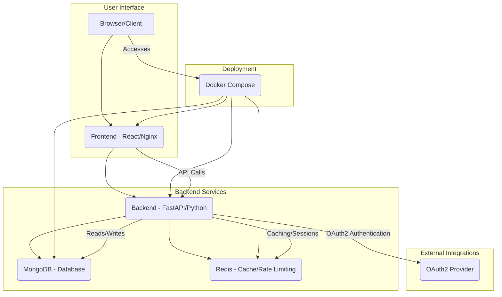

### Explanation of the Diagram:

*   **User Interface:** The user interacts with the application through their browser, which loads the React frontend served by Nginx.
*   **Backend Services:** The React frontend communicates with the FastAPI backend for all data operations. The backend, in turn, interacts with MongoDB for persistent data storage and Redis for caching and rate limiting.
*   **External Integrations:** The backend can integrate with an external OAuth2 provider for user authentication, allowing for single sign-on or centralized identity management.
*   **Deployment:** All services (Frontend, Backend, MongoDB, Redis) are containerized and orchestrated using Docker Compose, simplifying deployment and ensuring consistency across environments.