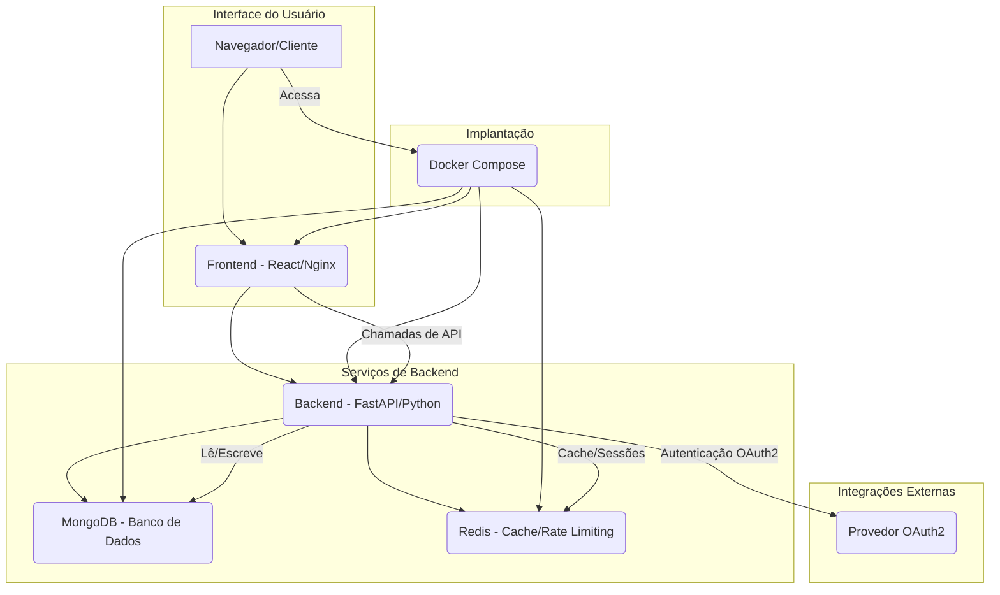

### Explicação do Diagrama:

*   **Interface do Usuário:** O usuário interage com a aplicação através do seu navegador, que carrega o frontend React servido pelo Nginx.
*   **Serviços de Backend:** O frontend React se comunica com o backend FastAPI para todas as operações de dados. O backend, por sua vez, interage com o MongoDB para armazenamento persistente de dados e com o Redis para cache e limitação de taxa (rate limiting).
*   **Integrações Externas:** O backend pode se integrar com um provedor OAuth2 externo para autenticação de usuários, permitindo single sign-on ou gerenciamento centralizado de identidade.
*   **Implantação:** Todos os serviços (Frontend, Backend, MongoDB, Redis) são conteinerizados e orquestrados usando Docker Compose, simplificando a implantação e garantindo consistência entre os ambientes.